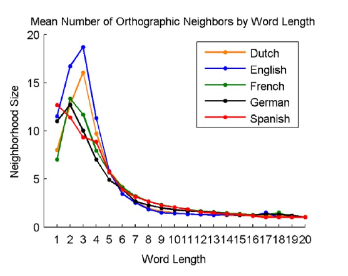
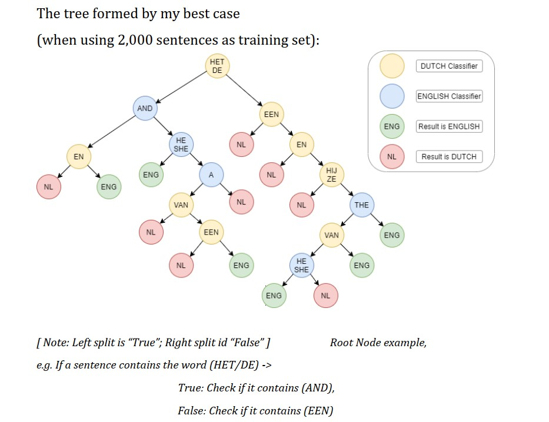
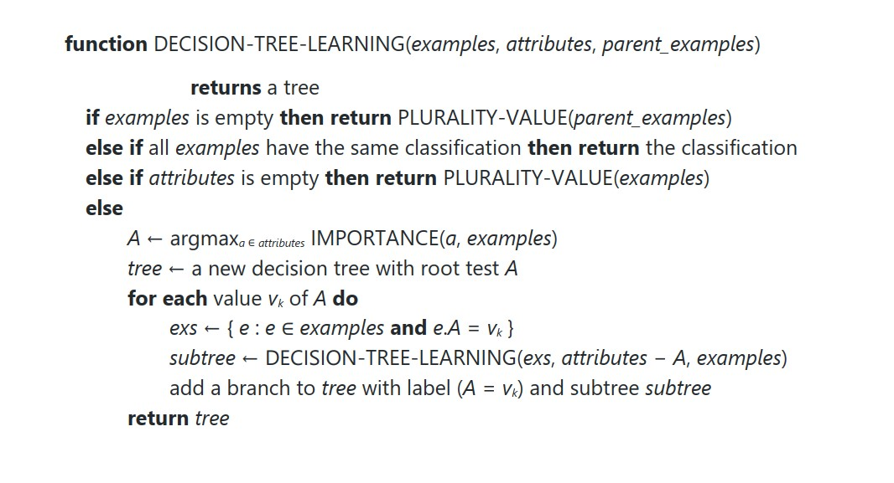
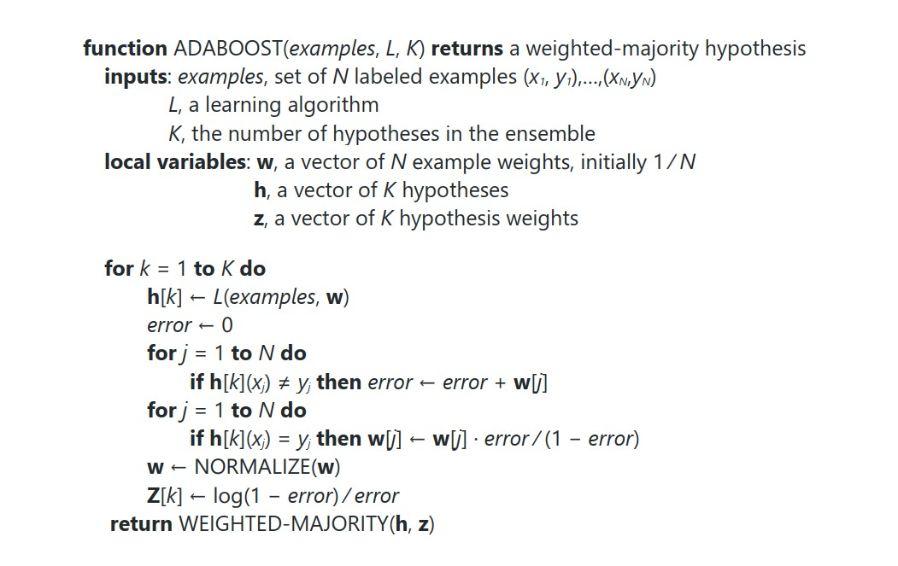

# Language Classifier

---

## Train the model:

- Training: The data file on which the model gets trained
- Output: The name of the file that will contain the trained model as a pickle object.
- Type: Type of model training; For decision trees put "dt"; For ada-boosted stumps put "ada"
- Testing: The file on which the model is tested for parameter tuning/best tree depth
    
    python3 train.py <Training> <Output> <Type> <Testing>
    
## Test the model:

- Model: filename of the model generated by train.py
- Data: The datafile for predicting the classifications

    python3 predict.py <Model> <Data>
    
    
    
 ---
 
 
### Features Selected:

I have selected all the features based on the most recurring words present in that language. I tried using average length of words, grammar, sentence construction, alphabets used, and frequency of alphabets.

All these features failed to provide accurate classifications.

<e.g.> For frequency of alphabets, in Dutch: E, N, A are most frequently used alphabets; whereas for English it is E, T, A. This was a poor differentiator.

For average word length, both
languages have a similar curve. Spike
up between 3-4. This too, was a poor
differentiator.

For sentence make-up and grammar; it was difficult to find the proper nouns-adjectives-pronouns etc. in the sentence. 

Dutch does not have rules like English and some sentences fail to provide right answers.
Hence, the features I selected were based on most common words used in their vernacular.

1) Check if the sentence contains “the” : It’s the most common word in
English language.
2) Check if the sentence contains “het” or “de” : It’s Dutch equivalent for
“THE”
3) Check if the sentence contains “and”
4) Check if the sentence contains “ik” : Dutch equivalent of ‘I’
5) Check if the sentence contains “een” : Dutch equivalent of ‘A’
6) Check if the sentence contains “en” : Dutch equivalent of ‘AND’
7) Check if the sentence contains “he” or “she” : Used in most
conversations and third person sentences
8) Check if the sentence contains “hij” or “ze” or “zij” : Dutch equivalent
of ‘HE / SHE’
9) Check if the sentence contains “van” : Dutch equivalent of
‘FROM/OF/BY’
10) Check if the sentence contains “a” : The English alphabet ‘a’.

---

---
### Algorithms used:

---
#### For Decision Trees:

---
#### For Ada-boosted stumps:

---

    
 

    
    
